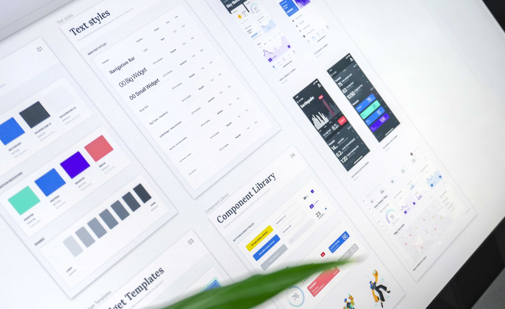

## Designers vs Developers 
🥊⚔☠
### Is it war?

---

| Key      | Description
| ---------|----------------------------------------- |
| ️⬅️ Arrow  | Go to previous slide (or step in Appear) |
| ➡️ Arrow  | Go to next slide (or step in Appear)     |
| Space    | Go to next slide (or step in Appear)     |
| Alt + P  | Toggle Presenter Mode                    |
| Alt + O  | Toggle Overview Mode                     |
| Alt + G  | Toggle Grid Mode                         |

(Ask me at the end if we have time)

---

---

or...

---

---

or...

---

---

How much do you enjoy working with designers?*

*🔗 sli.do/dvd

---

How do you work with them?**

**🔗 sli.do/dvd

---

How do we solve this? 🤯

🤬 -> 👨‍👨‍👧‍👦👩‍👦‍👦

---

Pain points 😱:

* V1 vs V2 version of designs
* Designers redesigning each time
* Designers working alongside vs ahead
* How much analysis do you need up front
* Version of the design? 20 links for the same page

---

# 🤖 vs 💄

---

import { Appear } from 'mdx-deck'

## How can we all get along?

<ol>
    <Appear>
        <li>Designs printed on the wall</li>
        <li>Style guides</li>
        <li>DSM</li>
        <li>Devs involved early</li>
        <li>Help each other out</li>
        <li>Design reviews</li>
        <li>Design sprints (with all involved)</li>
        <li>Get them on the team!</li>
    </Appear>
</ol>

---

Collaboration discussion [on Youtube](https://www.youtube.com/watch?v=8T94qu8IWWk)

---

Is this (really) agile?

---

Handoff 🏉 vs collaborative process 🔫

---

Tools?

---

---

<iframe width="560" height="315" src="https://www.youtube.com/embed/u3lRZYoFXow" frameborder="0" allow="accelerometer; autoplay; encrypted-media; gyroscope; picture-in-picture" allowfullscreen></iframe>

---

⛔ Controversy alert! 🙊

Should we as devs learn a bit of design?

---

---

---

# A `Design System`

## Will this solve all our problems? 

---

🤷‍♀

---

---

"A Design System is the single source of truth which groups all the elements that will allow the teams to design, realize and develop a product."

Ref: https://uxdesign.cc/everything-you-need-to-know-about-design-systems-54b109851969

---

Examples:*

* https://lightningdesignsystem.com/
* https://polaris.shopify.com/
* https://material.io/
* https://atlassian.design/
* https://airbnb.design/building-a-visual-language/
* Internal Valtech design systems available on request**

*but remember these are just hiring tools
** ping me and I can do a demo

---

`@timhacker` ©

https://designers-vs-developers.netlify.com/ 

---

Created using mdx-deck

https://github.com/jxnblk/mdx-deck

---

🐳 https://twitter.com/timhacker

🤖 https://github.com/timhacker

